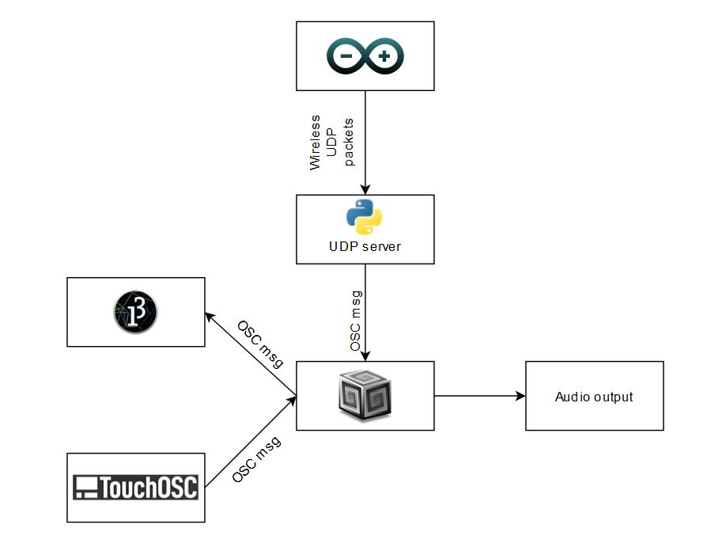

# FabStick

*Figure 1: FabStick block diagram*

## Project Overview

FabStick is a wireless music system that generates 'hit data' based on a performer's movements. This is accomplished using an Arduino MKR WiFi 1010 equipped with an accelerometer sensor. This data is then transmitted wirelessly to a Python server, which processes the data and sends it to Supercollider to generate audio. The performer also has real-time control over frequency, filter, reverb, and delay via a wireless controller based on TouchOSC. A Processing script provides visual feedback of the system state.

## License

This project is open-source and available under the [MIT License](LICENSE).
